# Graph API App-Only Web API Sample #

This provides Web API samples built in ASP.NET 5 and ASP.NET MVC 6 using Graph API, registered as an App-only application.

> This requires [Visual Studio 2015](https://www.visualstudio.com).


## Steps to Run this Sample Web API Application ##

As this sample application is using [Azure Active Directory (AAD)](https://azure.microsoft.com/en-us/services/active-directory) and [Graph API](https://graph.microsoft.io), it's a mandatory to register this app on your AAD first. Please follow the steps below.


### Clone Repository ###

Clone this repository to get sample source code.


### Create User Account on AAD ###

> You can skip this step, if you have already got a user account on AAD.
> **NOTE**: Microsoft Account won't work with this sample app.

Create a user account on AAD tenant. Once created, the user account should be a co-administrator of the Azure subscription that is currently being used.


### Register Application to AAD ###

Create and register a new application to AAD so that the sample Web API app can communicate with AAD and Graph API.

#### Step 1 &ndash; Create Application to AAD ####

1. Login to [Azure Management Portal](https://manage.windowsazure.com).
2. Select Active Directory.

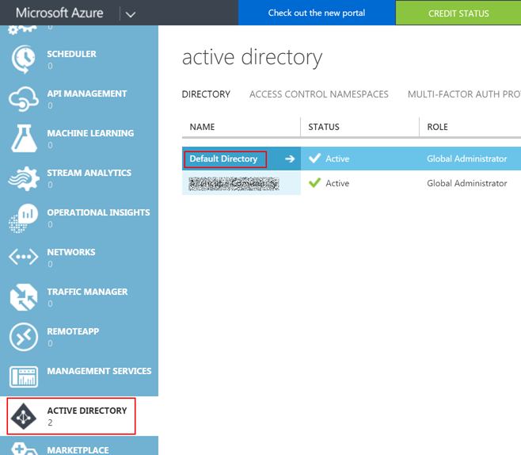

3. Create a new application.

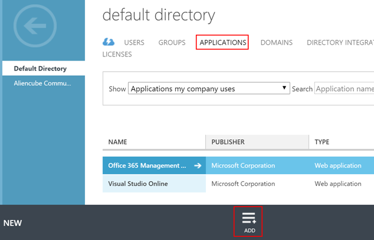

4. Choose the `Add an application my organization is developing` option.

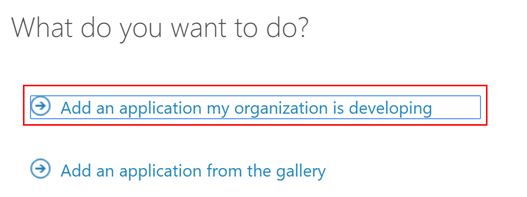

5. Enter the application name like `Graph API App-only Sample` and select the `Web Application and/or Web API` option. 

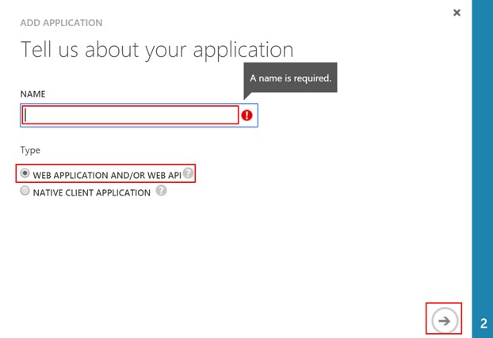

6. Enter `https://[tenant-name]/GraphApiAppOnlySample` for both fields. `[tenant-name]` should look like `contoso.onmicrosoft.com`. Please note that both won't be used at all.

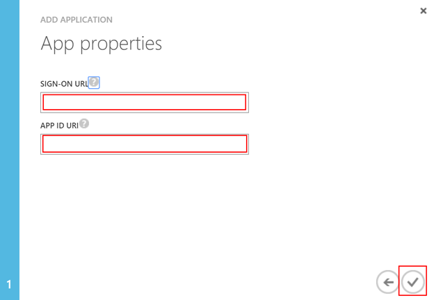

Now the app has been created.


#### Step 2 &ndash; Configure Application ####

1. Once the app is created, click the `configure` tab.

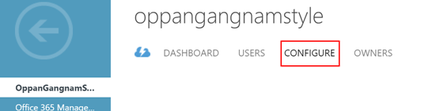

2. Get the `Client ID`.

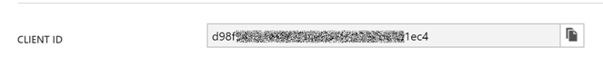

3. Get the secret key. Note that the key is only displayed once after click the `Save` button at the bottom.

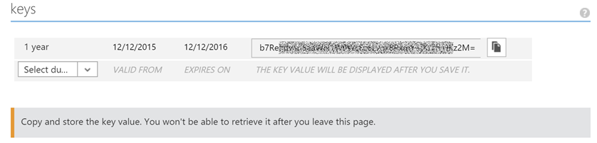

4. Give AAD all delegated permissions of 8. Make sure that, in the production app, appropriate number of delegated permissions **MUST** be given to avoid any security breach.

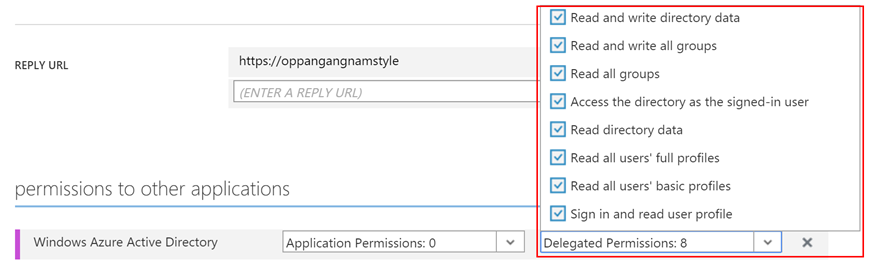

5. Add another application called `Microsoft Graph`

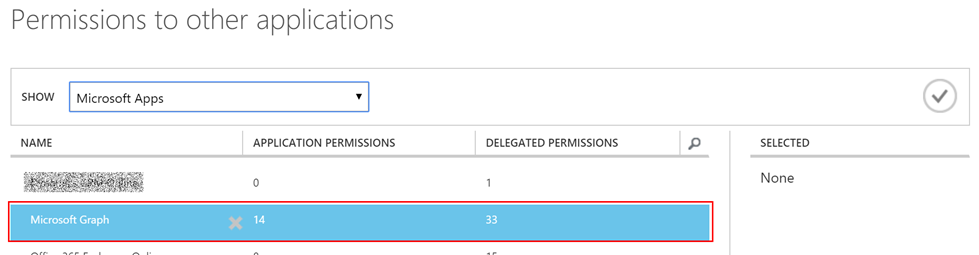

6. Give `Microsoft Graph` all application permissions of 14 and delegated permissions of 33. Make sure that, in the production app, appropriate number of application permissions and delegated permissions **MUST** be given to avoid any security breach.

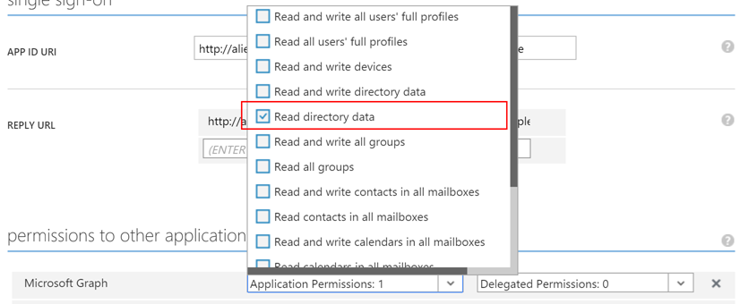

The app has been configured.


### Update Settings in Sample Application ###

As the app has been registered and configured, the sample Web API app should be setup with appropriate settings. Firstly, open `appsettings.json`

```
{
  "Logging": {
    "IncludeScopes": false,
    "LogLevel": {
      "Default": "Verbose",
      "System": "Information",
      "Microsoft": "Information"
    }
  },
  "GraphApp": {
    "Tenant": "contoso.onmicrosoft.com",
    "AuthUrl": "https://login.microsoftonline.com/{0}",
    "GraphUrl": "https://graph.microsoft.com",
    "Version": "v1.0",
    "ClientId": "client-id-value",
    "ClientSecret": "client-secret-key-value",
    "AppId": "https://contoso.onmicrosoft.com/GraphApiAppOnlySample"
  }
}
```

Then change values:

* `Tenant`: `contoso.onmicrosoft.com` to your tenant name.
* `ClientId`: Client ID from the app.
* `SlientSecret`: Secret key from the app.
* `AppId`: `contoso.onmicrosoft.com` to your tenant name.


### Trust IIS or IIS Express with a Self-signed Certificate ###

> You can skip this setp, if you already have a self-signed certificate on your root certificate storage.

All communications with AAD and Graph API are performed through a secure channel (SSL/TLS), this sample app **MUST** be signed with a root certificate. However, this is a developer's local environment, so a self-signed certificate should be issued and stored as a root certificate. The following steps show how to register self-signed certificate to the root certificate store using PowerShell.


#### Step 1 &ndash; Check Self-signed Certificate ####

First, Check if you have a self-signed certificate in your personal certificate store.

```
PS C:\WINDOWS\system32> dir Cert:\LocalMachine\My


    Directory: Microsoft.PowerShell.Security\Certificate::LocalMachine\My


Thumbprint                                Subject                                               
----------                                -------                                               
EBD8********************************6E42  CN=localhost
```

If there's no certificate with name of `CN=localhost`, you should create the one using `makecert.exe`. The easiest way to execute `makecert.exe` is to run `Developer Command Prompt for VS2015`.

```
makecert.exe -r -pe -n "CN=localhost" -b 01/01/2015 -e 12/31/2020 -ss My -len 2048
``` 

* `-r`: Create a self signed certificate.
* `-pe`: Mark generated private key as exportable.
* `-n`: Certificate subject X509 name. eg) `-n "CN=localhost"`
* `-b`: Start of the validity period in `mm/dd/yyyy` format; default to now.
* `-e`: End of validity period in `mm/dd/yyyy` format; defaults to 2039.
* `-ss`: Subject's certificate store name that stores the output certificate. eg) `-ss My`
* `-len`: Generated Key Length (Bits). Default to `2048` for 'RSA' and `512` for 'DSS'.


#### Step 2 &ndash; Store Self-signed Certificate to Root Store ####

Second, store the self-signed certificate to the root store.

```
PS C:\WINDOWS\system32> $cert = (Get-Item Cert:\LocalMachine\My\EBD8********************************6E42)
PS C:\WINDOWS\system32> $store = (Get-Item Cert:\Localmachine\Root)
PS C:\WINDOWS\system32> $flags = [System.Security.Cryptography.X509Certificates.OpenFlags]::ReadWrite
PS C:\WINDOWS\system32> $store.Open($flags)
PS C:\WINDOWS\system32> $store.Add($cert)
PS C:\WINDOWS\system32> $store.Close()
```

Finally, you can verify the self-signed certificate has been stored into the root store.

```
PS C:\WINDOWS\system32> dir Cert:\LocalMachine\Root


    Directory: Microsoft.PowerShell.Security\Certificate::LocalMachine\Root


Thumbprint                                Subject                                               
----------                                -------                                               
...
EBD8********************************6E42  CN=localhost 
...
```


### Build and Run Sample Web API Application ###

All setup has been completed! Now, build the solution in Visual Studio 2015 and punch `F5` key to get into the `Debug` mode. Then you'll get a JSON response of your tenant organisation details.


## Contribution ##

Your contributions are always welcome! All your work should be done in your forked repository. Once you finish your work, please send us a pull request onto our `dev` branch for review.


## License ##

**Graph API App-Only Web API Sample** is released under [MIT License](http://opensource.org/licenses/MIT)

> The MIT License (MIT)
>
> Copyright (c) 2015 [DevKimchi](http://devkimchi.com)
> 
> Permission is hereby granted, free of charge, to any person obtaining a copy of this software and associated documentation files (the "Software"), to deal in the Software without restriction, including without limitation the rights to use, copy, modify, merge, publish, distribute, sublicense, and/or sell copies of the Software, and to permit persons to whom the Software is furnished to do so, subject to the following conditions:
> 
> The above copyright notice and this permission notice shall be included in all copies or substantial portions of the Software.
> 
> THE SOFTWARE IS PROVIDED "AS IS", WITHOUT WARRANTY OF ANY KIND, EXPRESS OR IMPLIED, INCLUDING BUT NOT LIMITED TO THE WARRANTIES OF MERCHANTABILITY, FITNESS FOR A PARTICULAR PURPOSE AND NONINFRINGEMENT. IN NO EVENT SHALL THE AUTHORS OR COPYRIGHT HOLDERS BE LIABLE FOR ANY CLAIM, DAMAGES OR OTHER LIABILITY, WHETHER IN AN ACTION OF CONTRACT, TORT OR OTHERWISE, ARISING FROM, OUT OF OR IN CONNECTION WITH THE SOFTWARE OR THE USE OR OTHER DEALINGS IN THE SOFTWARE.
